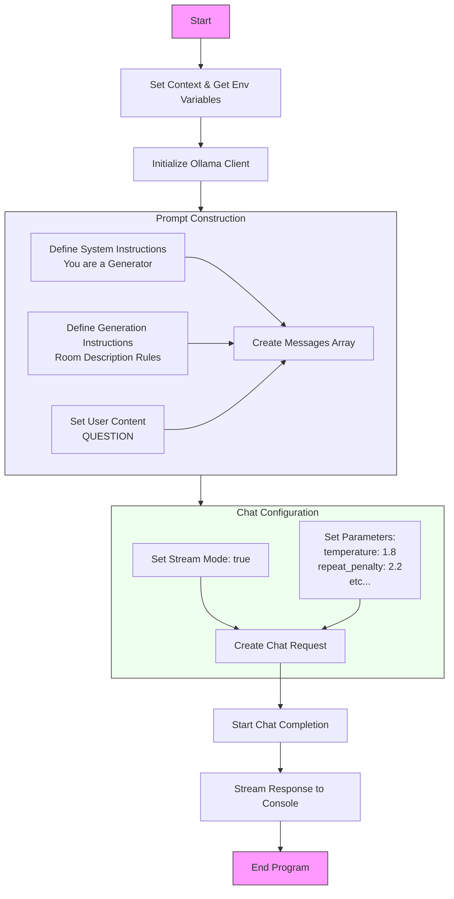

# Générer des descriptions de salles

## Que fais le code ?



## Allons voir le code

[Le code](main.go)

## Que font le 🐳 compose file & le Dockerfile ?

- [Le 🐳 compose file](compose.yml) ... C'est quoi ce `watch` ?
- [Dockerfile](Dockerfile)

## Lancer l'application

```bash
docker compose up --watch
```
> Et attendez un peu ⏳ ... qur tous les services soient démarrés.

## 🚧 Travaillez un peu

- Essayez avec d'autre noms de pièces : `userContent`
- Vous pouvez modifier les instructions : `systemInstructions` & `generationInstructions`
- Jouer aussi avec les settings (en fait uniquement la `temperature`) ... 🤔 mais pourquoi ? *(Explications à donner)*

## Questions ?

## Quittez Docker Compose

[README](../README.md)