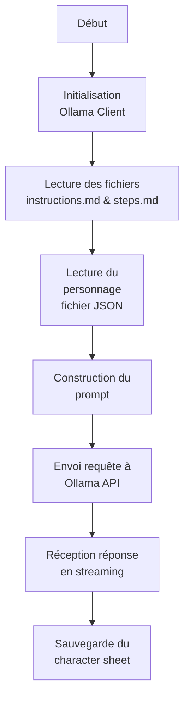

# Générer des descriptions de PNJ

## Que fait ce programme ?



## Allons voir le code

[Le code](main.go)

## Que font le 🐳 compose file & le Dockerfile ?

- [Le 🐳 compose file](compose.yml) ... ✋👀 **le LLM a changé**
- [Dockerfile](Dockerfile)

## Lancer l'application

```bash
docker compose up --watch
```

## 🚧 Travaillez un peu

### Créer les instructions pour aider le LLM

Allez modifier le fichier [`steps.md`](steps.md) pour expliquer au LLM ce dont vous avez besoin (en anglais 🇬🇧).

- Expliquez au LLM qu'il doit générer une fiche descriptive pour un personnage donné
- Donnez les informations dont vous avez besoin (Kind, Name, Age, Family, Occupation, Physical Appearance, Background Story, Quote, Personality, ...)
- Expliquez le format de sortie que vous souhaitez (markdown)

😈 **Soyez créatifs**


### Générer une fiche pour les 3 personnages

Modifiez 3 fois le code pour pouvoir générer 3 feuilles de personnage (il faut modifier le code Go: juste le nom du fichier JSON à charger)

> Vous pouvez jouer avec la température si les résultat ne vous conviennent pas.

Ensuite gardez les fichiers markdown générés (`character-sheet-*.md`), nous les ré-utiliserons plus tard.
> vous pouvez les copier dans:
- `06-bot-npc`
- `07-bot-with-memory`
- `08-bot-with-rag`


## Questions ?

## Quittez Docker Compose

[README](../README.md)


