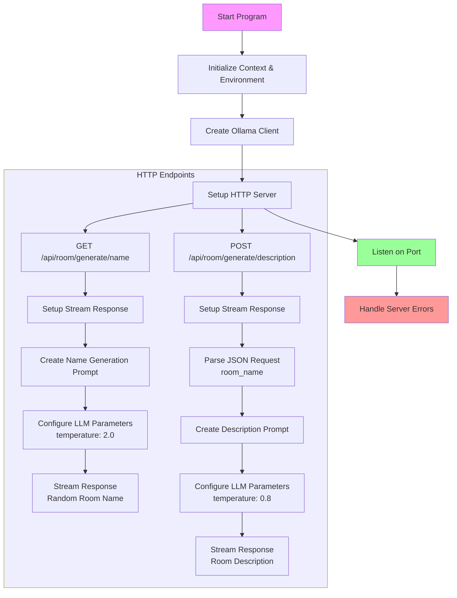

# Room service

## Objectif

Faire un service qui permet d'obtenir une description de pièce à partir d'un nom.

## Que fait ce programme ?



## Allons voir le code

[Le code](main.go)

## Que font le 🐳 compose file & le Dockerfile ?

- [Le 🐳 compose file](compose.yml) 
- [Dockerfile](Dockerfile)

## Lancer l'application

```bash
docker compose up --watch
```

## 🚧 Travaillez un peu

- Ré-utilisez le code de `01-generate-room-description` pour définir le prompt (instructions, questions, ...) qui seront utilisés par le end-point `POST /api/room/generate/description`
  - `systemInstructions`
  - `generationInstructions`


## Testez les services

### Avec curl

- `query-room-name.sh`
- `query-room-description.sh`


### Si vous n'avez pas curl

```bash
docker run --rm --network host curlimages/curl:8.6.0 \
    --silent --no-buffer "http://localhost:5050/api/room/generate/name" 

docker run --rm --network host curlimages/curl:8.6.0 \
    --silent --no-buffer "http://localhost:5050/api/room/generate/description" \
    -H "Content-Type: application/json" \
    -d '{"room_name":"Minion Lair"}'
```

## Questions ?

## Quittez Docker Compose

[README](../README.md)


