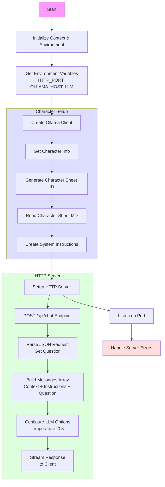

# Bot NPC

## Que fait ce programme ?

Le code est sensiblement le même que pour `05-room-services`

**Il va servir à envoyer des questions aux personnages non joueurs**




## Allons voir le code

[Le code](main.go)

## Que font le 🐳 compose file & le Dockerfile ?

- [Le 🐳 compose file](compose.yml) 
- [Dockerfile](Dockerfile)

## Lancer l'application

```bash
docker compose up --watch
```

## 🚧 Travaillez un peu

En vous inspirant de l'exemple des service `bot-elvira` dans le fichier [`compose.yml`](compose.yml):

```yaml
  bot-elvira:
    build: .
    command: go run main.go; sleep infinity
    environment:
      - OLLAMA_HOST=http://ollama-service:11434
      - LLM=qwen2.5:0.5b
      - CHARACTER_NAME=Elvira
      - CHARACTER_KIND=Elf
    depends_on:
      ollama-service:
        condition: service_started
    ports:
      - 5051:8080
    volumes:
      - ./:/app
    develop:
      watch:
        - action: rebuild
          path: ./main.go
```

- Ajoutez les 3 services correspondants à vos feuilles de personnage: `character-sheet-*.md`
- Supprimez le service `bot-elvira`

## Testez les services (au moins un des services)

### Avec curl

- `query-1.sh`
- `query-2.sh`
- `query-3.sh`
- `query-4.sh`

> Bien sûr, adaptez les requête (numéro de port HTTP par exemple)

### Si vous n'avez pas curl

```bash
docker run --rm --network host curlimages/curl:8.6.0 \
    --silent --no-buffer "http://localhost:5051/api/chat" \
    -H "Content-Type: application/json" \
    -d '{"question":"What is your name?"}'
```

etc ...

## Conclusion ?

## Questions ?

## Quittez Docker Compose

[README](../README.md)
