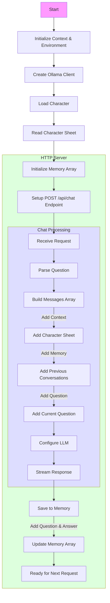

# Bot NPC + memory

Ce programme fait la même chose que pour `06-bot-npc` mais gère la **mémoire conversationnelle**.



## Allons voir le code

[Le code](main.go)

## Que font le 🐳 compose file & le Dockerfile ?

- [Le 🐳 compose file](compose.yml) 
- [Dockerfile](Dockerfile)

## Lancer l'application

```bash
docker compose up --watch
```

## 🚧 Travaillez un peu

Même exercice que le précédent, mais uniquement pour un service (un seul bot)


## Testez les services (au moins un des services)

### Avec curl

- `query-1.sh`
- `query-2.sh`
- `query-3.sh`

> Bien sûr, adaptez les requête (numéro de port HTTP par exemple)

### Si vous n'avez pas curl

```bash
docker run --rm --network host curlimages/curl:8.6.0 \
    --silent --no-buffer "http://localhost:5051/api/chat" \
    -H "Content-Type: application/json" \
    -d '{"question":"What is your name?"}'
```

etc ...

## Questions ?

## Quittez Docker Compose

[README](../README.md)
