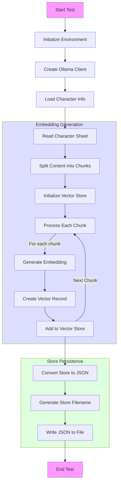
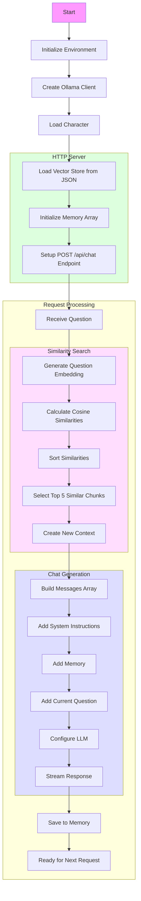

# Bot NPC + RAG
> Retrieval Augmented Generation

Cet exemple est à titre éducatif. Nous ne l'utiliserons pas pour le "jeu" définitif.

Mais cette technique peut être utile avec des petits LLM qui ne savent pas utiliser correctement des "gros contextes".

Cette fois nous allons travailler avec 2 modèles:

- `qwen2.5:0.5b`
- `snowflake-arctic-embed:33m`

Le 2ème LLM sert à générer des embeddings 😮🤔

- [Embeddings ?](docs/01-embeddings.md)
- [RAG ?](docs/02-rag.drawio)
- [Calcul de distance ?](docs/03-distance.md)

Nous avons donc 2 programmes:

## `chunking_test.go` pour générer les chunks



**[Le code](chunking_test.go)**

## `main.go` pour la complétion avec recherche de similarité



**[Le code](main.go)**

## Que font le 🐳 compose file & le Dockerfile ?

- [Le 🐳 compose file](compose.yml) 
- [Dockerfile](Dockerfile)

## Lancer l'application

```bash
docker compose up --watch
```


## 🚧 Travaillez un peu

- On va juste se contenter d'exécuter les codes
- Jetez un coup d'oeil à [`store-grym.json`](store-grym.json)


## Testez les services (au moins un des services)

### Avec curl

- `query-1.sh`, ensuite, essayez `docker compose logs bot-with-memory`
- `query-2.sh`, ensuite, essayez `docker compose logs bot-with-memory`
- `query-3.sh`, ensuite, essayez `docker compose logs bot-with-memory`
- `query-4.sh`, ensuite, essayez `docker compose logs bot-with-memory`

> Bien sûr, adaptez les requête (numéro de port HTTP par exemple)

### Si vous n'avez pas curl

```bash
docker run --rm --network host curlimages/curl:8.6.0 \
    --silent --no-buffer "http://localhost:5051/api/chat" \
    -H "Content-Type: application/json" \
    -d '{"question":"What is your name?"}'
```

etc ...

## Questions ?

## Quittez Docker Compose

[README](../README.md)