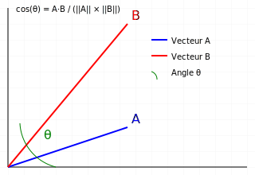

# Distance Cosine entre 2 vecteurs

- La **distance cosine** mesure la **similarité** entre deux vecteurs en calculant le cosinus de l'angle qui les sépare. 
- Plus les vecteurs sont similaires, plus le cosinus sera proche de 1.

## Points importants

- La distance varie entre `-1` et `1`
- `1` signifie que les vecteurs sont identiques (même direction)
- `-1` signifie qu'ils pointent dans des directions opposées

