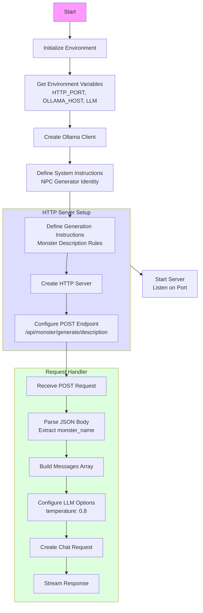

# Monsters service

## Que fait ce programme ?

C'est un service qui donne la description d'un monstre en fonction de son nom (même principe que pour les pièces `05-room-services`)



## Allons voir le code

[Le code](main.go)

## Que font le 🐳 compose file & le Dockerfile ?

- [Le 🐳 compose file](compose.yml)
- [Dockerfile](Dockerfile)

## Lancer l'application

```bash
docker compose up --watch
```
> Et attendez un peu ⏳

## 🚧 Travaillez un peu

C'est un exercice court.

- Ecrivez les instructions de génération de la description du monstre à partir de son nom
  - Autrement dit: renseignez le contenu de la variable `generationInstructions`


## Testez le services

### Avec curl

- `query-monster-description.sh`


### Si vous n'avez pas curl

```bash

docker run --rm --network host curlimages/curl:8.6.0 \
    --silent --no-buffer "http://localhost:5053/api/monster/generate/description" \
    -H "Content-Type: application/json" \
    -d '{"monster_name":"Bob Morane"}'
```

## Questions ?

## Quittez Docker Compose

[README](../README.md)