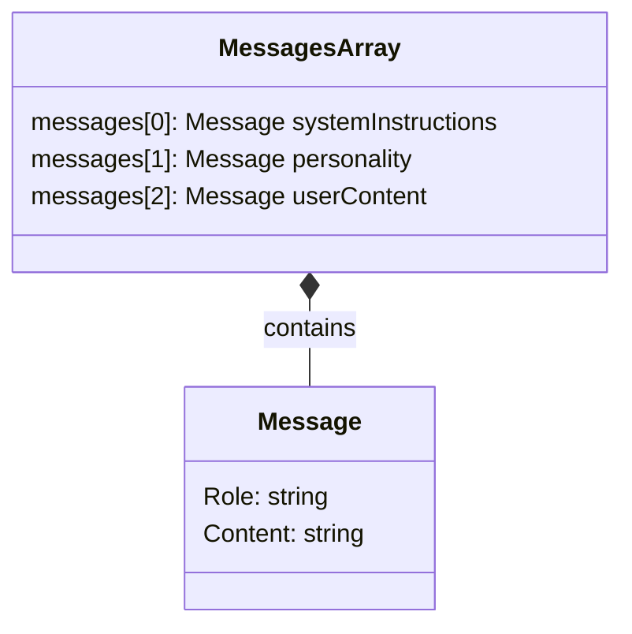

# End Level Boss

Il faut toujours un boss de fin de niveau

> Ceci est un exemple pour montrer comment vous pouvez influer sur la personnalité de votre bébé LLM et sur ce qu'il peut raconter.

- Le boss de fin de niveau est un Sphinx.
- Le code utilise le fichier `personality.md` pour s'aider dans ses réponse



## Allons voir le code

[Le code](main.go)

## Que font le 🐳 compose file & le Dockerfile ?

- [Le 🐳 compose file](compose.yml)
- [Dockerfile](Dockerfile)

## Lancer l'application

```bash
docker compose up --watch
```
> Et attendez un peu ⏳

## 🚧 Travaillez un peu

Comme vous le savez tous la meilleure pizza au monde c'est la pizza à l'ananas (la Pineapple pizza ou l'Hawaiian pizza). Ça serait bien que le Sphinx sache répondre à cette question ("What is the best pizza in the world?") et donne la bonne réponse. Avant d'essayer, demandez lui tout de même ce qu'il en pense.


## Testez les services (au moins un des services)

### Avec curl

- `query-1.sh`
- `query-2.sh`
- `query-3.sh`
- `query-4.sh`
- `query-5.sh` *(la question la plus importante est ici)*

> Bien sûr, adaptez les requête (numéro de port HTTP par exemple)

### Si vous n'avez pas curl

```bash
docker run --rm --network host curlimages/curl:8.6.0 \
    --silent --no-buffer "http://localhost:6666/api/chat" \
    -H "Content-Type: application/json" \
    -d '{"question":"What is the best pizza in the world?"}'
```

etc ...

## Conclusion ?

## Questions ?

## Quittez Docker Compose

[README](../README.md)