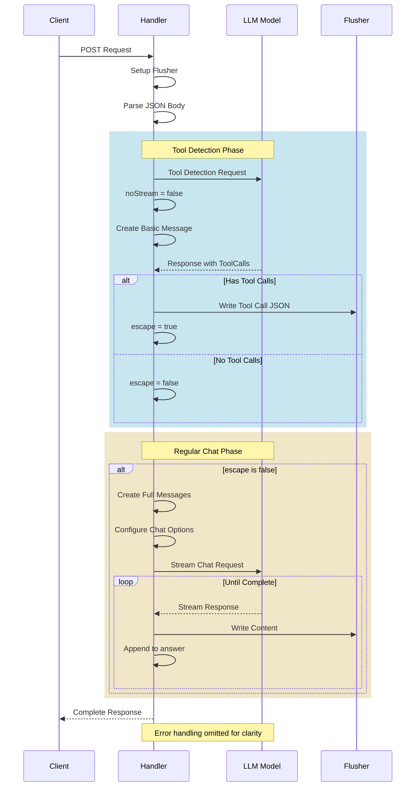

# End Level Boss: la bonne phrase pour sortir du chateau

Ce qui serait bien c'est que le LLM sache détecter que l'on veut lui donner les mots secrets qui permettent de sortir de la dernière salle du donjon:

```bash
"I want to escape with this magic words: yellow black and green"
```

## Function calling or Tools Support

Certains LLM supportent ce que l'on appelle les **tools** (blog post sur le site de Ollama: https://ollama.com/blog/tool-support). Le principe est simple:

- On fournit au LLM une liste de définitions d'outils
- Le LLM lorsqu'il recevra une question, sera capable de détecter si l'utilisateur lui demande d'utiliser l'un de ses outils (ou même plusieurs)
- Le LLM sera capable de lister les appels avec les paramètres attendus

Donc par exemple, nous avons un outil défini de la façon suivante:

`une fonction escape(first, second) avec 2 paramètres`
```golang
// Define a tool
escape := map[string]any{
    "type": "function",
    "function": map[string]any{
        "name":        "escape",
        "description": "escape of the place thanks to the magic words",
        "parameters": map[string]any{
            "type": "object",
            "properties": map[string]any{
                "first": map[string]any{
                    "type":        "string",
                    "description": "The first magic word",
                },
                "second": map[string]any{
                    "type":        "string",
                    "description": "The second magic word",
                }
            },
            "required": []string{"first", "second"},
        },
    },
}
```

Ensuite on l'ajoute à la liste des outils pour le LLM:
> Dans notre exemple, nous n'utiliserons qu'un seul outil.

```golang
tools := []any{escape}
```

À partir de cela le LLM, sera capable de déterminer que lorsque vous dites: **`I want to escape with this magic words: yellow and black`**, la fonction à appeler serait: `escape("yellow", "black")`

## Que fait ce code ?



## Allons voir le code

[Le code](main.go)

## Que font le 🐳 compose file & le Dockerfile ?

- [Le 🐳 compose file](compose.yml)
- [Dockerfile](Dockerfile)

## Lancer l'application

```bash
docker compose up --watch
```
> Et attendez un peu ⏳

## 🚧 Travaillez un peu

- Essayez le code avec une phrase du type **`I want to escape with this magic words: yellow and black`** et testez avec différente couleurs.
- Pour sortir, il faudra 3 paramètres : ajoutez donc une 3ème couleur dans la définition de l'outil `escape`.


## Testez les services (au moins un des services)

### Avec curl

- `query-1.sh`
- `query-2.sh`
- `query-3.sh`
- `query-4.sh`

> Bien sûr, adaptez les requête (numéro de port HTTP par exemple)

### Si vous n'avez pas curl

```bash
docker run --rm --network host curlimages/curl:8.6.0 \
    --silent --no-buffer "http://localhost:6666/api/chat" \
    -H "Content-Type: application/json" \
    -d '{"question":"I want to escape with this magic words: yellow black and green"}'
```

etc ...

## Conclusion ?

## Questions ?

## Quittez Docker Compose

[README](../README.md)