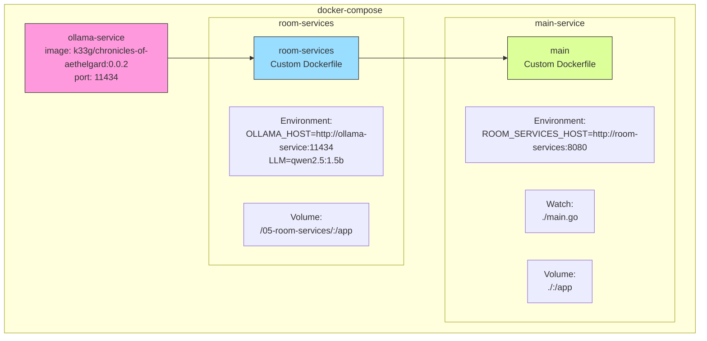

# Utiliser les "room services"

## Helpers

J'ai développé quelques utilitaires: [`services/rooms.go`](services/rooms.go)

Voici comment les utiliser: [`main.go`](main.go)

## Ce qui est important

Comprendre le fichier compose pour lancer les services: [Le 🐳 compose file](compose.yml) (utilisation des DNS Docker Compose)




## Lancer l'application

```bash
docker compose up --watch
```
> Et attendez un peu ⏳


## Questions ?

## Quittez Docker Compose

[README](../README.md)